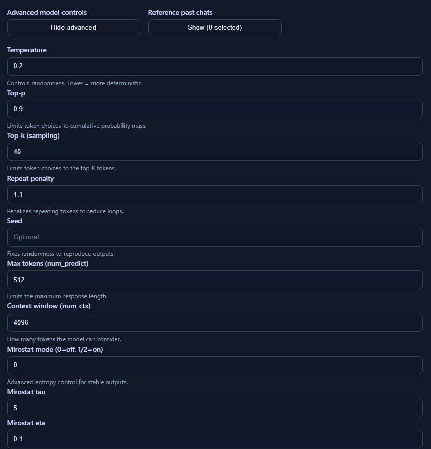

# Local RAG LLM with Ollama

A fully self-hosted, offline RAG (Retrieval-Augmented Generation) chat application built with LangChain, Ollama, and React. Query your personal documents without sending data to the cloud.

**Your data. Your control. Your privacy.**

## 🔒 Privacy & Control First

This project is built with **data sovereignty** as the core principle:

- **Zero Cloud Uploads** — All documents, embeddings, and conversations stay on your machine. Not a single byte leaves your device.
- **No Tracking** — No analytics, no telemetry, no third-party services. Complete privacy by default.
- **Full Ownership** — You own your data, your models, your vector store. Run it your way, modify it, or delete it anytime.
- **No Vendor Lock-in** — Use any Ollama model. Switch models, embedding models, or vector stores without external dependencies.
- **Open Source** — Inspect the code, audit security, contribute improvements. No closed-source black boxes.

## Features

- **100% Local & Offline** — All processing runs on your machine. No API calls, no cloud storage.
- **RAG (Retrieval-Augmented Generation)** — Augment the LLM with your personal document knowledge base.
- **Chat Sessions** — Maintain multiple conversation threads with persistent storage.
- **Cross-Chat References** — Reference and synthesize insights from previous conversations.
- **Advanced LLM Controls** — Fine-tune temperature, top-p, top-k, seed, and other generation parameters.
- **RAG Toggle** — Switch between knowledge-base mode and base LLM mode to save resources.
- **Automatic File Detection** — Vector store rebuilds when source files change.
- **Beautiful Dark UI** — Modern React frontend with real-time chat.

### Disclaimer:
This project is still in early stages of development, expect the associated tedium that comes with this. I have tried to provide accurate steps to utilize this code, but it is still in a "dev" oriented usage in its current build.

## Screenshots

### Chat Interface with Document Retrieval


*The main chat interface showing RAG-augmented queries with document sources and cross-chat capabilities.*

### Advanced LLM Parameter Tuning


*Fine-grained control over LLM generation with temperature, top-p, top-k, seed, and other advanced options that paid mass market LLMs would not often allow for.*

## Architecture

```
┌─────────────────────────────────────────────────────────────┐
│                     Frontend (React + Vite)                  │
│                    localhost:5173                            │
└────────────────────────┬────────────────────────────────────┘
                         │ HTTP/JSON
┌────────────────────────▼────────────────────────────────────┐
│                  Backend (FastAPI)                           │
│                 localhost:8000                               │
│                                                              │
│  ┌──────────────────┐  ┌──────────────────┐                │
│  │  Vector Store    │  │  Chat Persistence│                │
│  │  (Chroma)        │  │  (JSON Files)    │                │
│  └──────────────────┘  └──────────────────┘                │
│         │                                                    │
│         ├─ Document Loading (PDF, TXT, MD)                 │
│         ├─ Text Splitting (1000 chars/chunk)               │
│         └─ Embeddings (SentenceTransformer)                │
└────────────────────────┬────────────────────────────────────┘
                         │ Local HTTP
┌────────────────────────▼────────────────────────────────────┐
│               Ollama (Local LLM)                            │
│  gemma3:12b (or your chosen model)                          │
└──────────────────────────────────────────────────────────────┘

Data Flow:
  User Query → Frontend → Backend RAG Pipeline → Vector DB Search
           ↓
       Retrieved Context + History + Prompt → Ollama → LLM Response
           ↓
       Assistant Answer + Sources → Frontend (Persistent Chat)
```

## Quick Start

### Prerequisites

- **Python 3.10+**
- **Node.js 18+**
- **Ollama** installed and running locally with a model (e.g., `ollama pull gemma3:12b`)

### Setup

1. **Clone the repo**
   ```bash
   git clone <your-repo-url>
   cd private_rag_llm
   ```

2. **Install Python dependencies**
   ```bash
   pip install -r requirements.txt
   ```

3. **Start the backend**
   ```bash
   python -m uvicorn app.main:app --host 127.0.0.1 --port 8000
   ```
   The API will be available at `http://127.0.0.1:8000`

4. **Install and run the frontend** (in a new terminal)
   ```bash
   cd frontend
   npm install
   npm run dev
   ```
   The UI will be available at `http://localhost:5173`

5. **Add your documents**
   Place PDF, TXT, or Markdown files in the `./data/` folder. The vector store will rebuild automatically on the next query.

6. **Start chatting**
   Open the frontend and ask questions about your documents. The system will search your knowledge base and augment the LLM's response with relevant context.

## Configuration

### Backend (`app/config.py`)

- `DATA_DIR` — Folder containing your documents (default: `./data/`)
- `CHROMA_DIR` — Vector store location (default: `./chroma_db/`)
- `OLLAMA_MODEL` — Model name (default: `gemma3:12b`)
- `MODEL_NAME` — Embedding model (default: `all-MiniLM-L6-v2`)
- `CHUNK_SIZE` — Document chunk size in characters (default: `1000`)
- `CHUNK_OVERLAP` — Overlap between chunks (default: `200`)
- `API_TOKEN` — Optional Bearer token for API security

### Frontend (`frontend/src/App.jsx`)

- `API_BASE` — Backend URL (default: `http://127.0.0.1:8000`)

## API Endpoints

### `/query` (POST)
Submit a question and get an answer from the RAG pipeline.

**Request:**
```json
{
  "query": "What are the main points?",
  "k": 3,
  "use_rag": true,
  "reference_chats": ["chat-id-1"],
  "history": [{"role": "user", "content": "..."}, ...],
  "temperature": 0.7,
  "top_p": 0.9,
  "top_k": 40,
  "max_tokens": 512
}
```

**Response:**
```json
{
  "answer": "Based on the documents...",
  "sources": [
    {
      "source": "/path/to/document.pdf",
      "snippet": "Relevant text excerpt..."
    }
  ]
}
```

### `/chats` (GET, POST, PUT, DELETE)
Manage chat sessions. All chats are persisted to disk in `./chat_store/`.

- `GET /chats` — List all chats
- `POST /chats` — Create a new chat
- `GET /chats/{chat_id}` — Retrieve a specific chat
- `PUT /chats/{chat_id}` — Update a chat (save messages)
- `DELETE /chats/{chat_id}` — Delete a chat

### `/chats/summary/{chat_id}` (GET)
Get a brief summary of a chat for cross-referencing.

### `/health` (GET)
Health check endpoint.

### `/reindex` (POST)
Force a rebuild of the vector store from source documents.

## File Structure

```
.
├── app/
│   ├── main.py                 # FastAPI server and RAG pipeline
│   ├── indexer.py              # Document loading, chunking, embedding
│   ├── chat_store.py           # Chat persistence (JSON files)
│   ├── ollama.py               # Ollama integration (CLI + HTTP)
│   ├── schemas.py              # Pydantic models
│   └── config.py               # Configuration
├── frontend/
│   ├── src/
│   │   ├── App.jsx             # Main React component
│   │   ├── main.jsx            # Entry point
│   │   └── styles.css          # Styling
│   ├── package.json
│   └── vite.config.js
├── data/                        # Your documents (PDFs, TXT, MD)
├── chroma_db/                   # Vector store (SQLite + embeddings)
├── chat_store/                  # Chat sessions (JSON files)
├── requirements.txt             # Python dependencies
└── README.md                    # This file
```

## Supported Document Formats

- **PDF** — Text extraction using `pypdf`
- **TXT** — Plain text files
- **MD** — Markdown files
- **HTML** — HTML files

**Note:** Image-based PDFs (scanned documents) require OCR and are automatically skipped.

## How RAG Works

1. **Document Ingestion** — PDFs/TXT/MD files are loaded and split into 1000-character chunks with 200-character overlap.
2. **Embedding** — Each chunk is converted to a vector using `SentenceTransformer` (all-MiniLM-L6-v2).
3. **Storage** — Vectors and metadata are persisted in Chroma (SQLite + FAISS).
4. **Retrieval** — On query, the top-k most similar chunks are retrieved using cosine similarity.
5. **Augmentation** — Retrieved context is prepended to the user's query as a prompt.
6. **Generation** — Ollama's LLM generates a response based on the augmented prompt.

## LLM Parameters

Fine-tune how the model generates responses:

- **Temperature** (0.0–2.0) — Controls randomness. Lower = more deterministic.
- **Top-P** (0.0–1.0) — Nucleus sampling. Limits to cumulative probability mass.
- **Top-K** (1–100) — Limits token choices to the top K tokens.
- **Repeat Penalty** (0.0–2.0) — Penalizes repeating tokens to reduce loops.
- **Seed** — Fixes randomness to reproduce outputs.
- **Max Tokens** — Limits response length.
- **Context Window (num_ctx)** — How many tokens the model considers.
- **Mirostat** (0/1/2) — Advanced entropy control for stable outputs.

## Chat Sessions & References

The UI maintains multiple chat conversations:
- Each chat is stored as a JSON file in `./chat_store/`.
- Switch between chats in the sidebar.
- Reference past chats to synthesize cross-conversation insights.
- Delete chats with the ✕ button in the sidebar.

## Vector Store Management

The vector store is automatically rebuilt when:
- Source files change (detected via manifest hash comparison).
- The `./chroma_db/` directory is deleted.
- The `/reindex` endpoint is called.

To manually rebuild:
```bash
rm -rf ./chroma_db
python -m uvicorn app.main:app --host 127.0.0.1 --port 8000
```

## Troubleshooting

### Backend won't start
- Ensure Python 3.10+ is installed: `python --version`
- Check Ollama is running: `ollama serve` in another terminal
- Install dependencies: `pip install -r requirements.txt`

### Frontend can't connect to backend
- Verify backend is running on `http://127.0.0.1:8000`
- Check firewall/proxy settings
- Clear browser cache

### Vector store has old data
- Delete `./chroma_db/` and restart the backend
- Or call the `/reindex` endpoint

### Ollama model not found
- List available models: `ollama list`
- Pull a model: `ollama pull gemma3:12b`

### PDFs not indexing
- Ensure PDFs are in the `./data/` folder
- Check if they're text-based or scanned (scanned PDFs are skipped)
- Restart the backend to trigger reindexing

## Performance Tips

- Use a local SSD for faster vector store access.
- Adjust `CHUNK_SIZE` and `CHUNK_OVERLAP` based on your document types.
- Disable RAG mode (`use_rag=false`) if you want faster generation without retrieval.
- Use a smaller, faster model (e.g., `phi:2b`) for quick responses.

## Why Local?

### For Businesses & Organizations
- **Compliance** — Meet GDPR, HIPAA, SOX, and other data residency requirements.
- **Confidentiality** — Sensitive business documents never leave your infrastructure.
- **Control** — No subscription fees, no API rate limits, no vendor dependence.
- **Auditability** — Full visibility into what's happening with your data.

### For Individuals
- **Privacy** — Keep your personal documents, research, and ideas completely private.
- **Cost** — No ongoing API bills. One-time hardware investment.
- **Freedom** — Use your own models, tweak algorithms, run exactly as you want.
- **Offline** — Works without internet; no connectivity required.

## Security

- **The system is fully local and offline** — No data leaves your machine. Ever.
- **No external dependencies** — Ollama and embeddings run locally; no API calls to third parties.
- **Optional API token** — Set `API_TOKEN` in `app/config.py` to require a Bearer token for calls.
- **Chat persistence** — Chats are stored as JSON files locally; protect the `./chat_store/` directory if sensitive.
- **Vector store** — Your embeddings are stored in Chroma (SQLite) with full ownership.
- **Source transparency** — Code is open source; you can audit, modify, and secure it yourself.

**Important:** While the system is local, if you deploy this over a network:
- Use HTTPS/TLS for transport security
- Implement authentication/authorization
- Restrict network access to trusted clients
- Use VPN or private networks

## Future Enhancements

- [ ] OCR support for scanned PDFs (via Tesseract or cloud API)
- [ ] File upload UI (add documents without restarting)
- [ ] Background file watcher for auto-reindexing
- [ ] Hybrid search (BM25 + semantic)
- [ ] Multi-user support with user accounts
- [ ] Web UI deployment (Docker)
- [ ] End-to-end encryption for network deployments
- [ ] Audit logging for compliance

## TODO

### Containerization & Deployment
- [ ] **Containerize Application** — Create Docker image for easy deployment
  - Docker Compose setup for backend + frontend
  - Support for docker-compose.yml with volumes for data persistence
  - Multi-stage build for optimized image size
  - Pre-built images for common Ollama models
  - Add sections for custom context / system prompt controls for even more control over LLM performance and utility

### Remote Access & Security
- [ ] **Expose to Internet with Authentication**
  - OAuth2 / OpenID Connect support
  - Multi-user authentication with session management
  - Role-based access control (RBAC) for different permission levels
  - Rate limiting and DDoS protection
  - HTTPS/TLS certificate management (Let's Encrypt integration)
  - API key management for programmatic access

### Advanced Features
- [ ] **Document Management** — UI for uploading/deleting/managing documents without restart
- [ ] **Model Switching** — UI to switch between different Ollama models on-the-fly
- [ ] **Search Analytics** — Track which queries are most common, document popularity
- [ ] **Export Capabilities** — Export chats as markdown/PDF, export vector DB

### Infrastructure
- [ ] **Kubernetes Support** — Helm charts for K8s deployment
- [ ] **Database Migration** — Support PostgreSQL/MySQL as alternative to SQLite
- [ ] **Backup & Restore** — Automated backup of vector store and chats
- [ ] **Monitoring** — Prometheus metrics, health checks, logging aggregation

## License

MIT

## Contributing

Contributions welcome! Feel free to open issues or submit PRs.

---

**Questions?** Check the [Backend README](./README_BACKEND.md) and [Frontend README](./frontend/README_FRONTEND.md) for more details.
